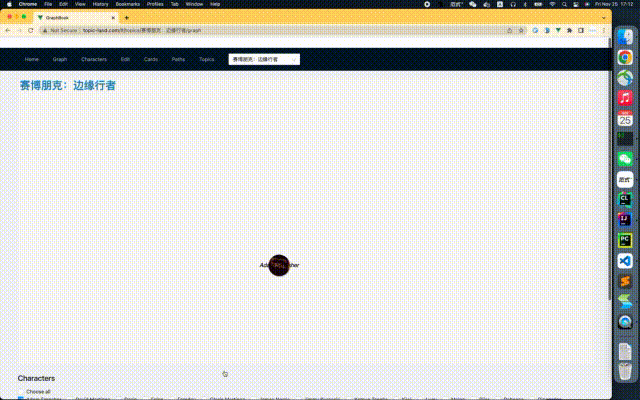
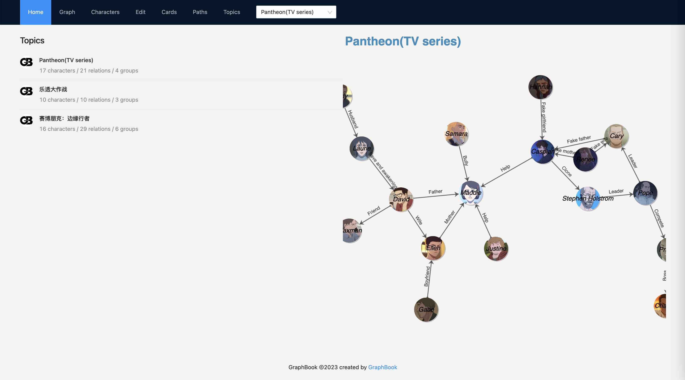
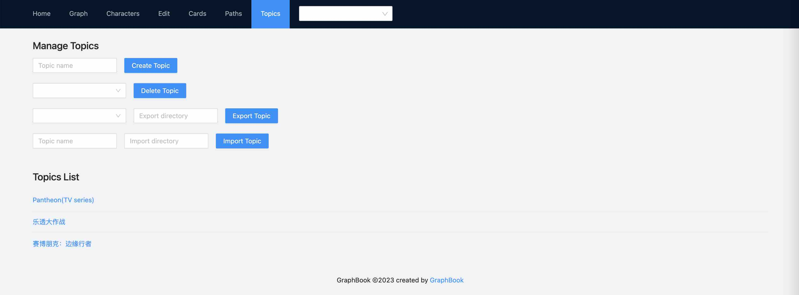
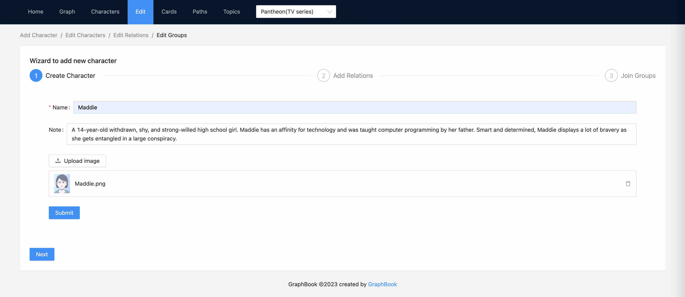
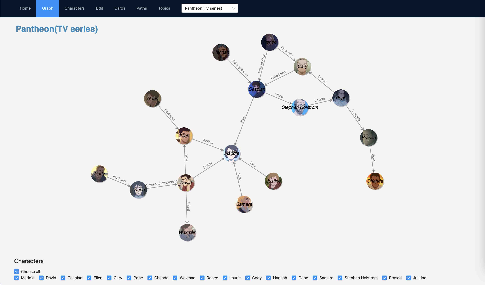
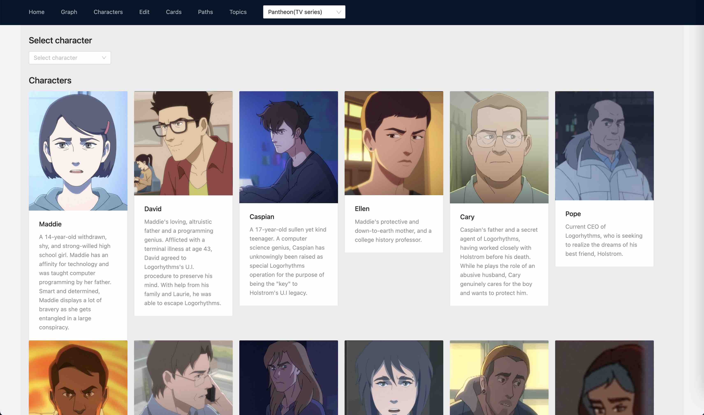
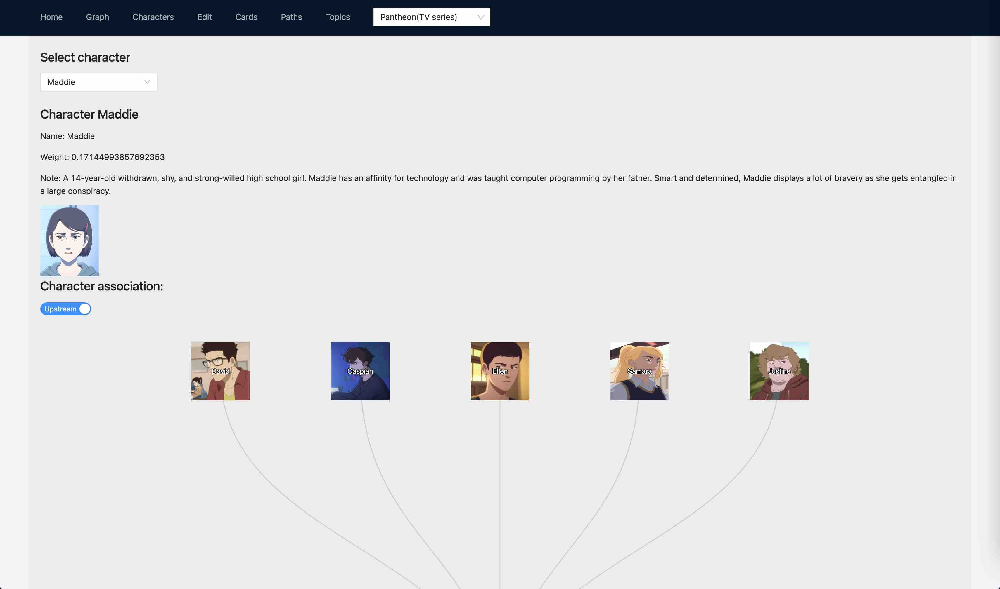

# Topic Land

**TopicLand** is the tool to manage and explore topics with knowledge graphs and so on.

It is recommanded to record and explore complex topics such as *novels*, *movies*, *TV series* and *games*.

* Clarify the relations of characters with [Knowledge Graph](https://en.wikipedia.org/wiki/Knowledge_graph).
* Use [PageRanke](https://en.wikipedia.org/wiki/PageRank) or other algorithms to select out the prominent roles. 
* Find the shortest path or all paths with [Dijkstra's Algorithm](https://en.wikipedia.org/wiki/Dijkstra%27s_algorithm) for any characters.
* Persistent your knowledge graphs for custom topics and share with others.



## Install

Build from scratch.

```
git clone https://github.com/tobegit3hub/GraphBook.git

cd ./GraphBook/graphbook_vue/
npm run build

cd ../python/server/
./server.py
```

## Usage

Explore the offical topics.



Create a new topic.



Add some characters and connect with relations.



View the knowledge graph and play the animation.



Check out the detail of characters.





## Contribution

* Web developers and designers are required to beautify the web pages.
* Content editors are welcome to add more outstanding topics.

Feel free to submit Issues or Pull-requests and any feedback is welcome.

